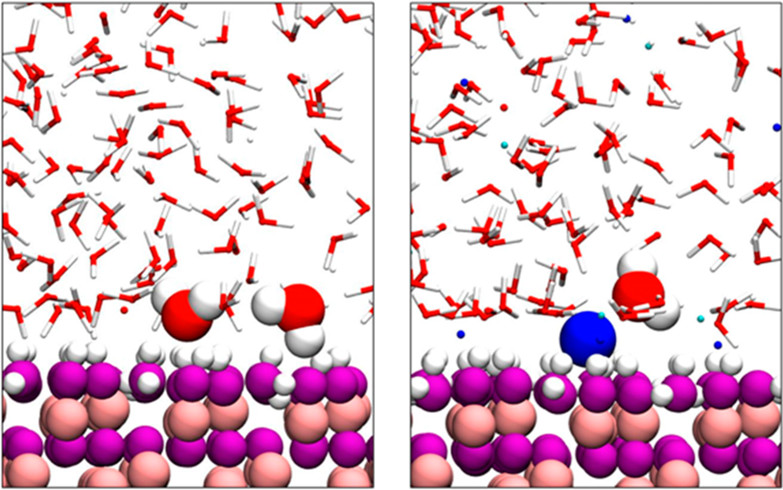
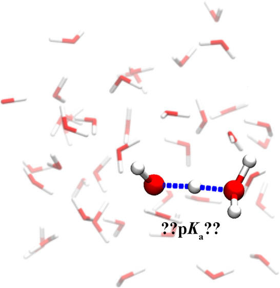

# Ruiyu Wang

## Bio

I am now a PhD student in Temple University. My supervisor is Dr. Eric Borguet and Dr. Vincenzo Carnevale.  
I am doing various types of research projects; I am focusing on water structures in several enviroments, such as chemical reactions in aqueous solutions, ion adsorption at water/alumina interfaces using both classical and ab initio molecular dynamics simulations, especially free energy calculations using enhanced sampling techniques. Our team are current investigating pKa calculations, surface-solute interactions and proton/hydroxide ion behavior.   
Besides "science", I am also interested in modern technologies such as machine learning and its applications, for example, how these tools and proper physics models help business analysis.

## Research Projects

Sodium halides adsorption at water/$\alpha$-alumina(0001) interfaces  

Calculation of bulk water pKa using the SCAN functional  

## Publications 
[Link to Google scholar](https://scholar.google.com/citations?hl=zh-CN&user=IkjmJh8AAAAJ&view_op=list_works&sortby=pubdate)

(At Temple University) 
**Wang, R.**, Klein M., Carnevale V. & Borguet E. (2019) Investigation of water/solid interfaces by molecular dynamic simulations (in preparation)  
**Wang, R.**, Carnevale V., Klein M. & Borguet E. First Principles Calculation of Water pKa Using the Newly Developed SCAN Functional. J. Phys. Chem. Lett. 2020, 11, 54-59. [link](https://pubs.acs.org/doi/abs/10.1021/acs.jpclett.9b02913)  
**Wang, R.**; DelloStritto, M.; Remsing, R. C.; Carnevale, V.; Klein, M. L.; Borguet, E., Sodium Halide Adsorption and Water Structure at the α-Alumina(0001)/Water Interface. J. Phys. Chem. C 2019, 123, 15618-15628. [link](https://doi.org/10.1021/acs.jpcc.9b03054)  

(At Nankai University) 
**Wang, R.**, Pan, J., Qin, M., & Guo, T., Molecularly imprinted nanocapsule mimicking phosphotriesterase for the catalytic hydrolysis of organophosphorus pesticides. European Polymer Journal 2019, 110, 1-8. [link](https://doi.org/10.1016/j.eurpolymj.2018.10.045)  
...and more.

[Link](url) and 
